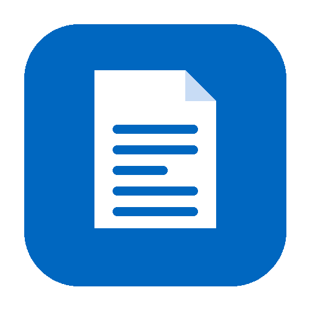
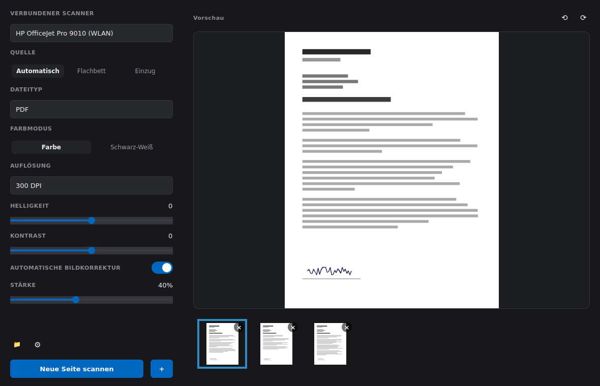
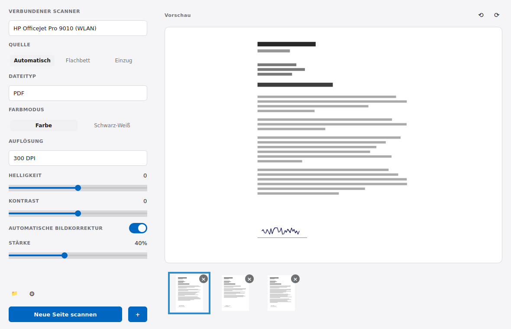
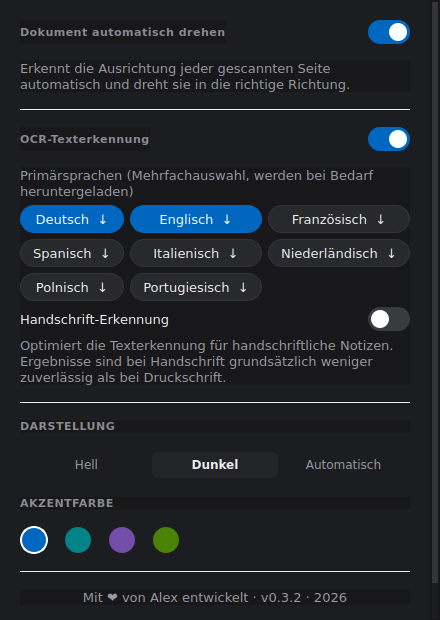

<div align="center">
  

  # Scanner

  **Ein moderner, plattformübergreifender Dokumentenscanner für Windows und Linux.**

  Direkter Zugriff auf im Betriebssystem hinterlegte Scanner, Mehrseiten-PDFs,
  automatische Ausrichtungserkennung und durchsuchbare Texterkennung (OCR) —
  alles in einer sauberen, dunklen wie hellen Oberfläche.

  [](https://github.com/CtrlCup/scanner/actions/workflows/ci.yml)
  [](https://github.com/CtrlCup/scanner/releases/latest)
  [](pyproject.toml)
  [-41cd52)](pyproject.toml)

  [Download](#download) · [Features](#features) · [Entwicklung](#entwicklung)
</div>

<br>



<details>
<summary>Auch im hellen Design</summary>
<br>

</details>

## Features

- **Direkter Scanner-Zugriff** — findet automatisch alle im Betriebssystem hinterlegten
  Scanner/Drucker (SANE unter Linux, WIA unter Windows), keine separate Treiber-Software nötig
- **Mehrseitige PDFs** — Seiten werden fortlaufend gesammelt, jede neue Seite wird sofort
  im gewählten Speicherpfad gespeichert; „+" hängt an, „Neue Seite scannen" startet immer
  ein frisches Dokument
- **Seitenverwaltung** — Seiten per Drag & Drop neu anordnen, einzeln löschen, drehen
- **Automatisches Drehen** — erkennt die Ausrichtung jeder Seite selbstständig (Tesseract-OSD)
  und dreht sie korrekt, ohne manuelles Zutun
- **OCR-Texterkennung** — macht PDFs durchsuchbar, mit Mehrsprachauswahl und
  Hintergrund-Download weiterer Sprachpakete bei Bedarf
- **Optionale Handschrift-Erkennung** — schaltet die Texterkennung auf einen für
  unregelmäßige Schrift robusteren Modus um
- **Helles, dunkles oder automatisches Design** — plus wählbare Akzentfarbe, folgt auf
  Wunsch der Systemeinstellung



## Download

Fertige Builds gibt es auf der [Releases-Seite](https://github.com/CtrlCup/scanner/releases/latest) —
jede Datei ist dort mit einem Label versehen, welche Plattform sie abdeckt.

| Datei | Für |
|---|---|
| `Scanner-*-windows-x86_64-setup.exe` | Windows 10/11 (64-bit) — Installer (empfohlen: Startmenü-Eintrag, sauberes Deinstallieren) |
| `Scanner-*-windows-x86_64.exe` | Windows 10/11 (64-bit) — portable, ohne Installation direkt startbar |
| `Scanner-*-x86_64.AppImage` | Linux, universell — `chmod +x`, dann ausführen |
| `scanner_*_amd64.deb` | Linux — Debian, Ubuntu und Derivate |
| `scanner-*-1.x86_64.rpm` | Linux — Fedora, RHEL, openSUSE und Derivate |
| `scanner-*-linux-x86_64.tar.gz` | Linux — portables Archiv zum manuellen Entpacken |

Für OCR und automatisches Drehen wird zur Laufzeit `tesseract` benötigt, für den Scanner-Zugriff
unter Linux `sane`-Backends für das jeweilige Gerät (unter Windows läuft WIA bereits im System).

## Entwicklung

```bash
python3 -m venv .venv
.venv/bin/pip install -e ".[dev]"
.venv/bin/scanner
```

Details zu Architektur, Tests und dem Paket-Build (`.exe`/AppImage/deb/rpm/tar.gz) stehen in
[`CLAUDE.md`](CLAUDE.md).

Versionierung folgt [SemVer](https://semver.org/lang/de/) über automatisierte
[Conventional Commits](https://www.conventionalcommits.org/de/) — jeder Release auf `main` baut
und veröffentlicht alle fünf Paketformate automatisch.

---

<div align="center">
Mit ❤ entwickelt · <a href="https://github.com/CtrlCup/scanner">github.com/CtrlCup/scanner</a>
</div>
